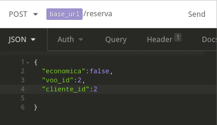
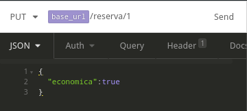

# Api_Voos
Trabalho da disciplina de Sistemas distribuidos

## Banco de dados
voos_db

## Variaveis de ambiente
.env

DB_HOST=localhost

DB_PORT=5432

#### usuario do Banco

DB_USER=

#### senha do Banco

DB_PASSWORD=

#### nome do Banco

DB_DATABASE=

## Rodando a aplicação
#### instala as dependencias, (node_modules)
npm install

#### inicia o servidor
npm start

## Rotas

get('/voo/:origem/:destino')

Ex: localhost:3003/voo/São Paulo/Manaus

get('/voo/:origem/:destino/:dataPartida')

Ex: localhost:3003/voo/Palmas/Brasília/2019-06-22

get('/voo/:origem/:destino/:dataPartida/:preco')

Ex: localhost:3003/voo/São Paulo/Manaus/2019-11-12/350

post('/reserva')

Ex:

put('/reserva/:reserva')

Ex:

delete('/reserva/:reserva')
